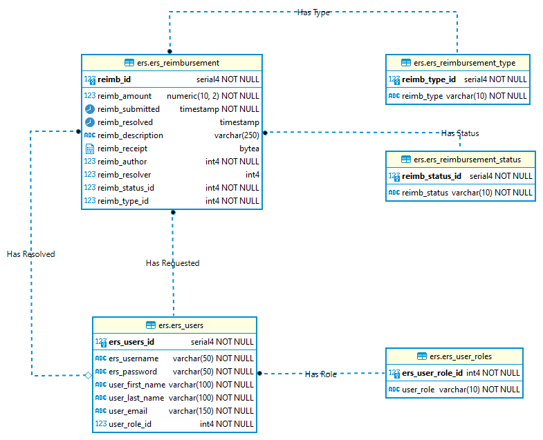
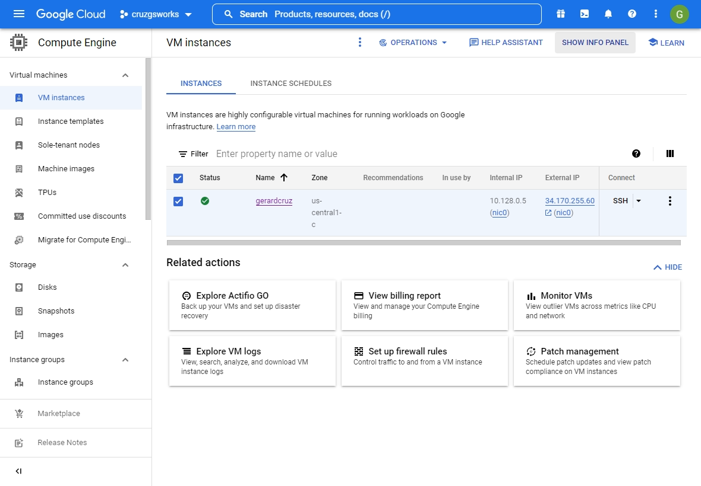
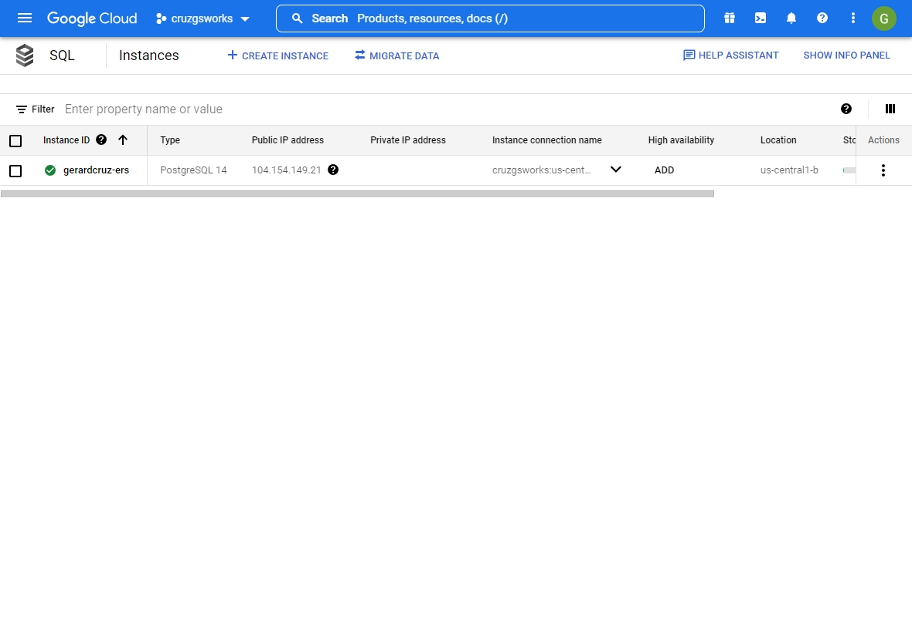
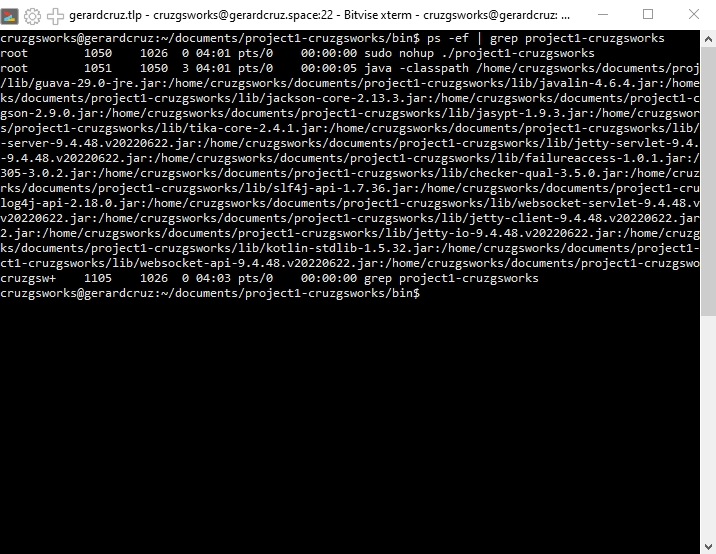
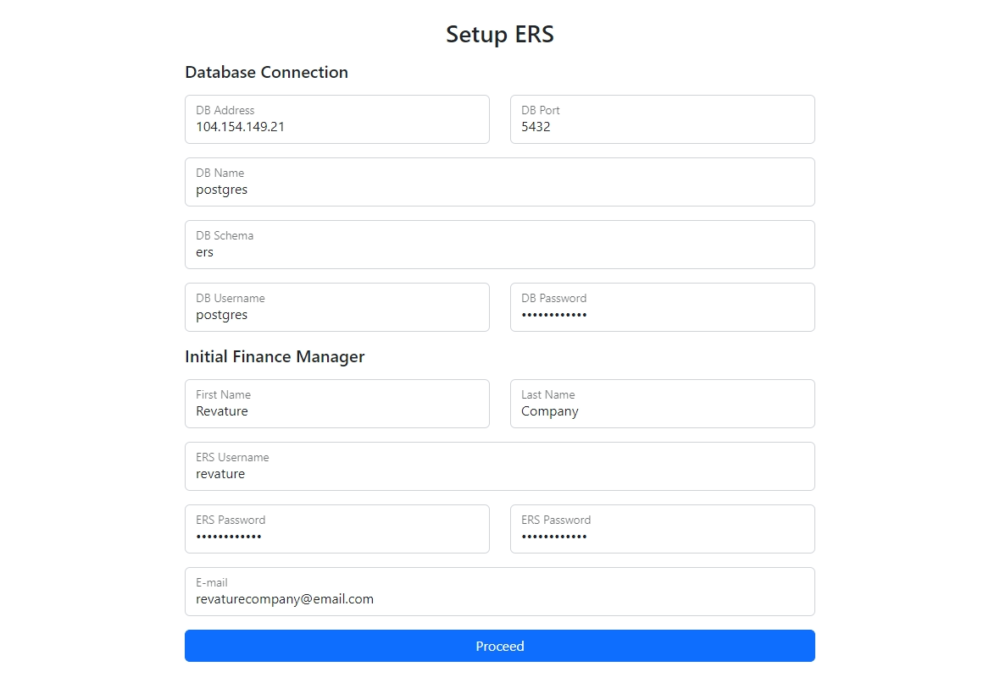
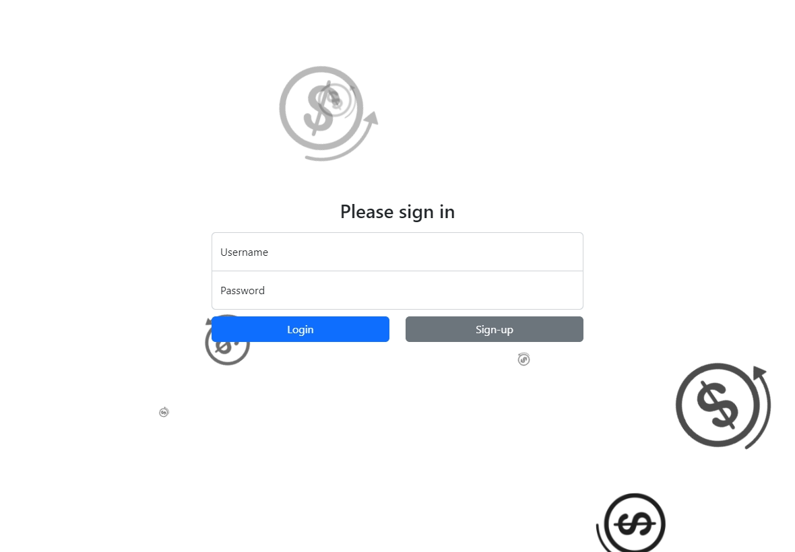
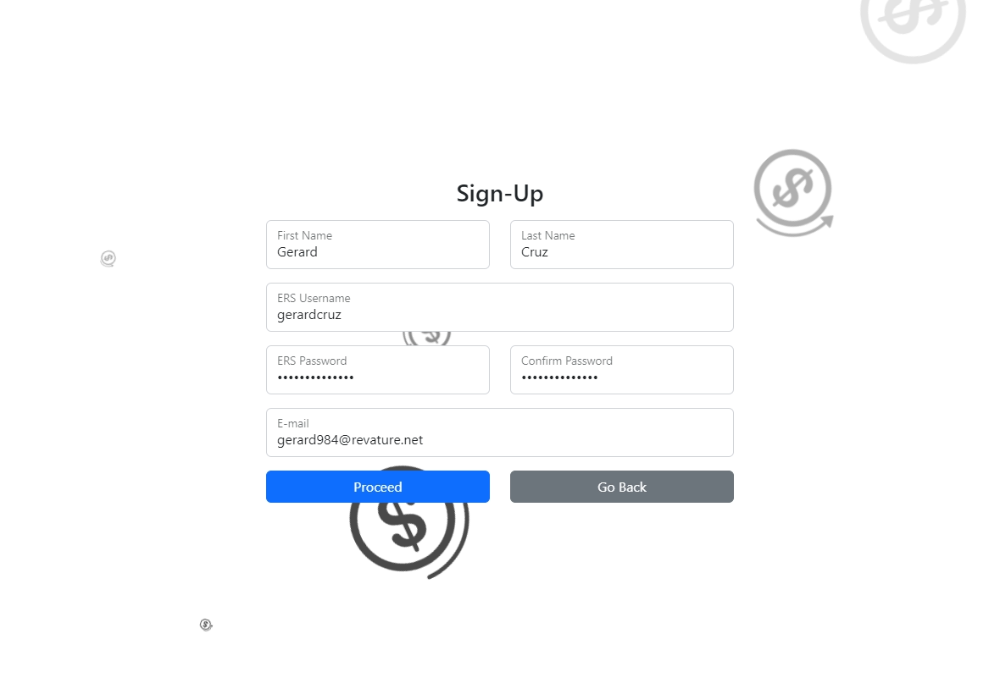
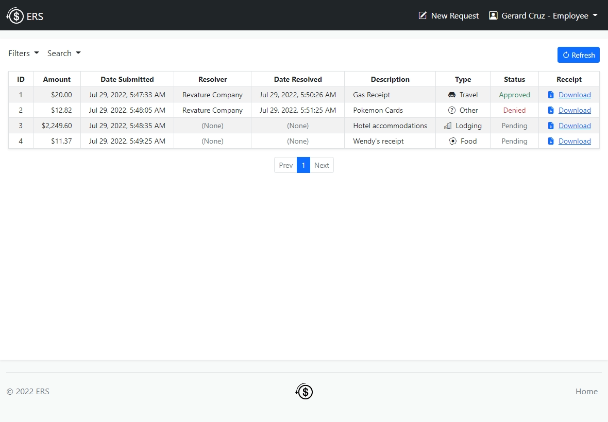
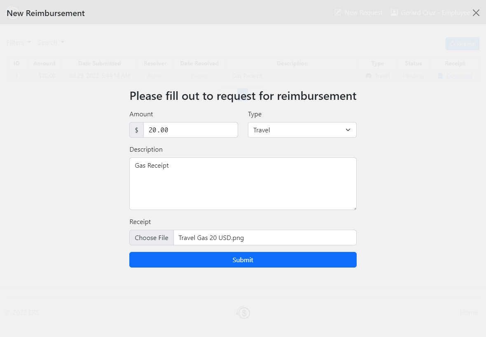
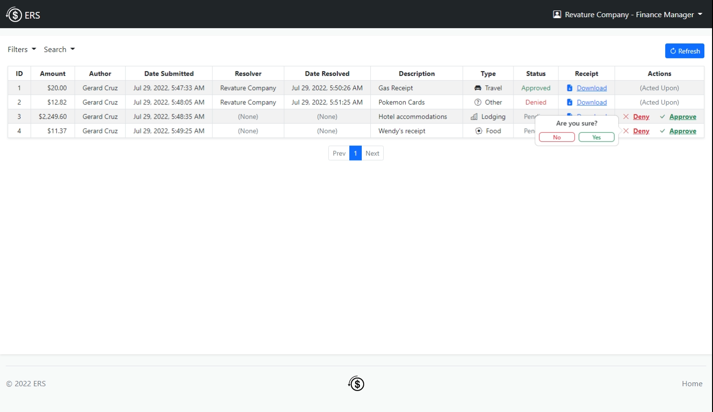

# Employee Reimbursement System (ERS)

## Project Details

- Deployed in a VM in GCP.
- PostgresDB instance in GCP as well.
- Can be accessed through (SSL Enabled) [https://gerardcruz.space:8443/](https://pages.github.com/)

## Current ERD (Postgres)

## Some Screenshots
- *GCP VM Instance*

&nbsp;&nbsp;&nbsp;&nbsp;&nbsp;&nbsp;&nbsp;&nbsp;&nbsp;

- *GCP SQL DB Instance*

&nbsp;&nbsp;&nbsp;&nbsp;&nbsp;&nbsp;&nbsp;&nbsp;&nbsp;

- *Running Jar in background*

&nbsp;&nbsp;&nbsp;&nbsp;&nbsp;&nbsp;&nbsp;&nbsp;&nbsp;

- *Initial setup page*

&nbsp;&nbsp;&nbsp;&nbsp;&nbsp;&nbsp;&nbsp;&nbsp;&nbsp;

- *Login page*

&nbsp;&nbsp;&nbsp;&nbsp;&nbsp;&nbsp;&nbsp;&nbsp;&nbsp;

- *Registration page*

&nbsp;&nbsp;&nbsp;&nbsp;&nbsp;&nbsp;&nbsp;&nbsp;&nbsp;

- *Employee page*

&nbsp;&nbsp;&nbsp;&nbsp;&nbsp;&nbsp;&nbsp;&nbsp;&nbsp;

- *New reimbursement request*

&nbsp;&nbsp;&nbsp;&nbsp;&nbsp;&nbsp;&nbsp;&nbsp;&nbsp;

- *Finance manager page*

&nbsp;&nbsp;&nbsp;&nbsp;&nbsp;&nbsp;&nbsp;&nbsp;&nbsp;

## Executive Summary
The Expense Reimbursement System (ERS) will manage the process of reimbursing employees for expenses incurred while on company time. All employees in the company can login and submit requests for reimbursement and view their past tickets and pending requests. Finance managers can log in and view all reimbursement requests and past history for all employees in the company. Finance managers are authorized to approve and deny requests for expense reimbursement.

**State-chart Diagram (Reimbursement Statuses)** 

**Logical Model**

**Physical Model**

**Use Case Diagram**

**Activity Diagram**

## Technical Requirements

The back-end system shall use JDBC to connect to a Postgres database. The middle tier shall use Javalin technology for dynamic Web application development. The front-end view shall use HTML/CSS/JavaScript to make an application that can call server-side components in a generally RESTful manner. The middle tier shall follow proper layered architecture, and have EITHER 10 JUnit tests or 10 logs. Webpages shall be styled to be functional and readable. 

**Stretch Goals (if you'd like to use this technology):**

* Postgres Database shall be hosted remotely on an AWS RDS. 

* Employees must select the type of reimbursement as: LODGING, TRAVEL, FOOD, or OTHER.

## Misc Notes

* This README should prove helpful when getting the big picture of everything you need to do... However, what should be most helpful to you is understanding how the P1Demo operates and emulating that in your own P1. Luckily, everyone is doing the same project this time so that should make collaboration much easier. Buddy up ASAP to figure this stuff out!

* Remember the logical progression of our java applications. We tend to go from the main method, to the controller layer, to the service layer, to the DAO (aka repository) layer. There are exceptions to this rule of thumb, but in general it's a good rule to follow, and my P0Demo will be refactored into the P1Demo accordingly. 

* I (Ben) can only teach you so much -- This project will require you to do a bit of self study since I won't make the P1Demo as hand holdy as the P0Demo. Your BEST resource when self studying besides google is each other. This is a great opportunity to figure out how to articulate your problems to others and help others with their own problems. Web dev is not an introverted role...

* When creating your applications, the diagrams above are simply suggestions for best practice... There are easier and harder ways to implement the same thing. For instance: 
    * The reimbursements table in your database only **needs** the required fieds in the diagram (indicated with the red asterisks). Similar story with the users table. Further, the reimbursement status is a separate table in the logical and physical models, but you may opt to simply make status a field in the reimbursement table to skip the addition of the extra table (though it's good practice).
    * The Use Case and Activity diagrams are **not** all of the required functionalities you may need, but are good to look at to make sure your application is flowing properly. 

* Let me reiterate - HELP EACH OTHER! Don't spend 3 hours on the same problem when you could talk it out with your peers after ~1 hour of bashing your head against stackoverflow.com. But of course, do you own work and make sure to actually learn or you'll have a bad time during P2. 
